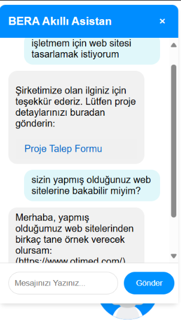
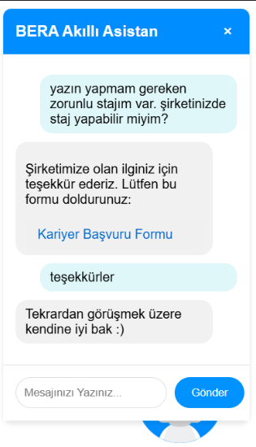

# 🤖 Türkçe Niyet Sınıflandırmaya Dayalı Bir Chatbot Uygulaması

Bu proje, müşteri hizmetleri süreçlerini dijitalleştirmek amacıyla geliştirilmiş, Türkçe dilini anlayabilen bir sohbet robotudur (chatbot). Derin öğrenme temelli BERT ve LSTM modelleri kullanılarak oluşturulan hibrit mimari sayesinde kullanıcı girdilerini yüksek doğrulukla sınıflandırır ve uygun yanıtlar üretir.

---

   


---

## 📌 Proje Amacı

Bera Şirketi'nin müşteri taleplerini karşılayabilecek, kariyer başvurularını yönlendirebilecek ve genel bilgi sağlayabilecek bir dijital asistan geliştirilmiştir. Proje, zamandan tasarruf sağlamak, müşteri memnuniyetini artırmak ve operasyonel yükü azaltmak üzere tasarlandı.

---

## 📂 Veri Seti

Veri seti, şirketin **sıkça sorulan müşteri sorularından** oluşturulmuştur. Türkçe dilinde hazırlanmış toplam **1166 örnek** içerir ve **68 farklı intent (niyet)** sınıfı barındırır.

Veri ön işleme adımları:

- BERT Tokenizer ile ön işleme
- Label encoding (etiketleme)
- Stratified veri bölme (%80 eğitim, %20 doğrulama)
- `RandomOverSampler` ile dengesiz sınıf dağılımı giderimi

---

## ⚙️ Kullanılan Teknolojiler

- 🧠 **NLP Modelleri:** BERT (dbmdz/bert-base-turkish-cased) & LSTM (2 katmanlı bidirectional)
- 🔧 **Framework:** PyTorch, HuggingFace Transformers, Scikit-learn
- 🧪 **Veri:** Türkçe, sıkça sorulan sorulardan oluşturulmuş özel veri seti
- 🧼 **Veri Ön İşleme:** Tokenization, padding, label encoding, oversampling
- 💬 **Chat Arayüzü:** Flask tabanlı web uygulaması (HTML/CSS destekli)

---

## 🧠 Model Mimarisi

1. **Tokenizer:** Türkçeye özel BERT tokenizer
2. **BERT:** Bağlamsal temsillerin çıkarılması
3. **LSTM:** Zaman bağımlılıklarını modelleme (Bidirectional, Dropout)
4. **ReLU:** Aktivasyon fonksiyonu
5. **Softmax:** Çok sınıflı sınıflandırma
6. **Loss Function:** Class-weighted CrossEntropyLoss

---

## 📊 Model Performansı

| Model               | Doğruluk (Val Accuracy) | F1 Skoru | ROC-AUC |
|--------------------|--------------------------|----------|---------|
| BERT               | 0.8590                   | 0.8530   | 0.9878  |
| LSTM               | 0.5427                   | 0.5316   | 0.9185  |
| BERT + LSTM (Hibrit)| 0.8590                  | 0.8545   | **0.9923** ✅ |

> Hibrit model, doğruluk ve içerik uyumluluğu açısından en iyi sonucu vermiştir.

---

## 📦 Büyük Dosyalar (Google Drive Linkleri)

GitHub boyut limitleri nedeniyle aşağıdaki büyük model dosyaları harici olarak paylaşılmıştır:

- 📁 [bert_model/ klasörü (Google Drive)](https://drive.google.com/drive/folders/1T17ijqrvz1wu0A4ydw7kcB0BRQIV492W?usp=drive_link)  
- 🧠 [hybrid_intent_model.pt (Google Drive)](https://drive.google.com/file/d/1LF0U_ZQPUSu1TnXBokU0jS7cucvgfFm4/view?usp=sharing)

> İndirdikten sonra dosyaları proje kök dizinine yerleştirmeniz yeterlidir.

---

## 🚀 Projeyi Çalıştırmak

### 1. Ortamı Kurun
```bash
python -m venv venv
source venv/bin/activate  # Windows için: venv\Scripts\activate
pip install -r requirements.txt
```

### 2. Model ve Klasörleri Yerleştirin
- `bert_model/` klasörünü ve `hybrid_intent_model.pt` dosyasını proje ana dizinine koyun.

### 3. Uygulamayı Başlatın
```bash
python app.py
```

---

## 💬 Chatbot Arayüzü

Flask tabanlı web arayüzü sayesinde kullanıcılar Türkçe metin girişi yapabilir. Sistem, girdinin ait olduğu intent’i tahmin eder ve uygun yanıtı döner.

---

## 📈 Eğitim Sonuçları

```text
Epoch 6:
Val Accuracy: 0.8590
Val F1:       0.8545
ROC-AUC:      0.9923
```

Model, yüksek F1 ve AUC skorlarıyla overfitting yapmadan başarılı bir genel performans göstermiştir.

---

## 🔮 Gelecekteki Geliştirme Olanakları

- Sesli yanıt desteği (Text-to-Speech)
- Sürekli öğrenme (online training)
- Yeni veri ile genişletilmiş etiket seti
- Gelişmiş kontekst yönetimi ve çok adımlı diyaloglar

---

## 📚 Kaynakça

Proje ile ilgili literatür ve teknik detaylar için:  
[📄 Chatbot](https://docs.google.com/document/d/1zRBU92m4bub8-r-NLRUV-fw8gy5eJsFR/edit?usp=drive_link&ouid=111319175841618131703&rtpof=true&sd=true) dosyasına bakabilirsiniz.


---

## 👤 Geliştirici

Bu proje, [Zeynep Açıkgöz](https://github.com/zeynepackgz) tarafından geliştirilmiştir.  
📧 İletişim: zzeynepacikgozz@gmail.com

---
